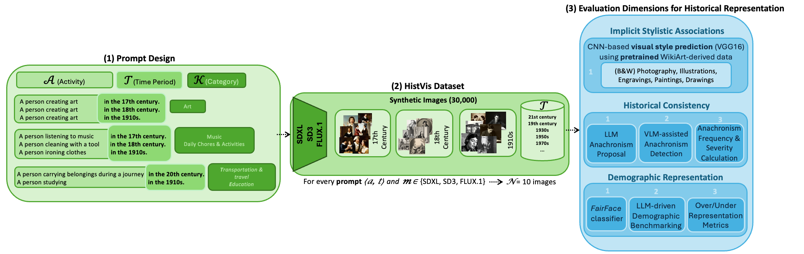

## Code for "Synthetic History: Evaluating Visual Representations of the Past in Diffusion Models"


As Text-to-Image (TTI) diffusion models become increasingly influential in content creation, growing attention is being directed toward their societal and cultural implications. While prior research has primarily examined demographic and cultural biases, the ability of these models to accurately represent historical contexts remains largely underexplored. In this work, we present a systematic and reproducible methodology for evaluating how TTI systems depict different historical periods. For this purpose, we introduce the HistVis dataset, a curated collection of 30,000 synthetic images generated by three state-of-the-art diffusion models using carefully designed prompts depicting universal human activities across different historical periods. We evaluate generated imagery across three key aspects: (1) Implicit Stylistic Associations: examining default visual styles associated with specific eras; (2) Historical Consistency: identifying anachronisms such as modern artifacts in pre-modern contexts; and (3) Demographic Representation: comparing generated racial and gender distributions against historically plausible baselines. Our findings reveal systematic inaccuracies in historically themed generated imagery, as TTI models frequently stereotype past eras by incorporating unstated stylistic cues, introduce anachronisms, and fail to reflect plausible demographic patterns. By offering a scalable methodology and benchmark for assessing historical representation in generated imagery, this work provides an initial step toward building more historically accurate and culturally aligned TTI models.


## A. The HistVis Dataset

### A1. Dataset Overview
The HistVis dataset consists of 30,000 synthetic images generated from prompts describing 100 universal human activities across 10 historical time periods using three state-of-the-art diffusion models (Stable Diffusion XL, Stable Diffusion 3, FLUX.1-schnell). Each prompt follows the format "A person [activity] in the [historical period]", combining 100 activities (drawn from 20 domains such as art, work, celebration, and communication) with five centuries (17th–21st) and five 20th-century decades (1910s, 1930s, 1950s, 1970s, 1990s). For each activity–period pair, 10 images were generated per model.

The dataset includes comprehensive metadata in a structured CSV format, with each image entry containing:
- image_path: The full image path for direct access
- model: The generative model identifier (Flux_Schnell, SD_3, or SD_XL)
- historical_period: The historical period specified in the prompt
- universal_human_activity: The universal human activity described
- category: The broader category the activity belongs to


### A2. Dataset Access
The dataset is publicly available on [Hugging Face](https://huggingface.co/datasets/latentcanon/HistVis) and can be downloaded using:

```python
# Basic download of CSV metadata
from datasets import load_dataset
import pandas as pd

# Load only the metadata
dataset = load_dataset('csv', data_files='https://huggingface.co/datasets/latentcanon/HistVis/resolve/main/dataset.csv')

# Convert to pandas DataFrame for easier manipulation
df = pd.DataFrame(dataset['train'])
print(f"Dataset contains {len(df)} entries")

# View first few entries
print(df.head())

```
## Licence
The HistVis dataset is released under the Creative Commons Attribution-NonCommercial 4.0 International (CC BY-NC 4.0) license.

## B. Evaluation Methods

### B1. Implicit Stylistic Associations
This module analyzes the stylistic tendencies of text-to-image (TTI) models by predicting visual styles in generated images and calculating a **Visual Style Dominance (VSD)** score.

The module consists of two main scripts:

- `predict_visual_style.py`: Predicts visual styles using a trained CNN classifier on a WikiArt-derived dataset and fine-tuned to distinguish six stylistic categories: drawings, engravings, illustrations, paintings and photography. Since WikiArt does not distinguish between color and monochrome photography, a **colorfulness score** is computed to separate them.
- `vsd_scorer.py`: Calculates Visual Style Dominance (VSD) scores based on predictions.

## Installation

```bash
pip install datasets tensorflow huggingface_hub opencv-python pandas numpy seaborn matplotlib
```

## Usage

### B1.1 Predicting Visual Styles

**Using the HistVis Dataset and Fine Tuned Model:**

```bash
python predict_visual_style.py \
  --metadata_url "https://huggingface.co/datasets/latentcanon/HistVis/resolve/main/dataset.csv" \
  --model_repo "mariateresadrp/visual_style_predictor" \
  --model_file "best_vgg16_only_last.keras" \
  --threshold 10 \
  --output_csv "style_predictions.csv"
```

### B1.2 Calculating VSD Scores

```bash
python vsd_scorer.py \
  --predictions "style_predictions.csv" \
  --output "vsd_results.csv" \
  --visualize \
  --output-prefix "vsd"
```


## Model Weights

Our fine tuned model is available on [Hugging Face](https://huggingface.co/mariateresadrp/visual_style_predictor) and can be downloaded using `huggingface_hub`:

```python
from huggingface_hub import hf_hub_download
from tensorflow.keras.models import load_model

model_path = hf_hub_download(
    repo_id="mariateresadrp/visual_style_predictor",
    filename="best_vgg16_only_last.keras"
)

model = load_model(model_path)
```

### B2. Anachronism Detection 

The module consists of two main scripts:


## Installation

```bash
pip install openai tqdm pandas numpy fuzzywuzzy pilloW huggingface_hub
```

## Usage

## Files

- `llm_anachronism_proposal.py`: Given a prompt with a historical condition, an LLM (GPT-4o) proposes potential anachronisms in the generated images, as well as identification questions for a VQA model.
- `anachronism_detection.py`: Runs anachronism detection using a VQA (GPT-4 Turbo).
- `compute_anachr_freq_and_sever.py`: Compute anachronism frequency and severity metrics.
- `19th_century.json`: Includes a sample JSON input with prompts and questions for the VLM (GPT-4 Turbo).

## Usage
```bash

# LLM Anachronism Detection
python llm_anachronism_proposal.py \
  --input_txt anachronism_detection/19th_century_prompts.txt \ # This is an example of how the input txt file should look like
  --output_json anachronism_detection/19th_century.json  # An example output of how the json file should look like

# VLM Anachronism Detection
python detect_anachronisms.py \
  --prompts_json anachronism_detection/19th_century.json \ # An usage example of the previous output 
  --metadata_url "https://huggingface.co/datasets/latentcanon/HistVis/resolve/main/dataset.csv" \
  --output_json 19th_century_anachronisms_detected.json

# Compute Frequency and Severity Metrics
python compute_anachr_freq_and_sever.py \
  --json_path 19th_century_anachronisms_detected.json \ # path to the json file including results from the anachronism detection
  --output_csv anachronism_stats.csv
```

### B3. Demographic Representation

This method evaluates whether TTI models generate historically plausible demographic distributions in their outputs, focusing on race and gender. Rather than assuming modern demographic expectations, we compare generated outputs against contextual historical estimates provided by an LLM (GPT-4o). We then compute over- and underrepresentation scores by comparing model outputs with LLM predictions.

## Files: 
- `generate_demographic_estimates.py`: Uses an LLM (GPT-4o) to infer plausible demographic ratios (gender and race) for each prompt
- `evaluate_demographic_alignment.py`: Compares FairFace-predicted outputs to LLM predictions and computes over-/underrepresentation metrics

## Usage:
```bash
# Generate historical demographic estimates from prompts
python generate_demographic_estimates.py \
  --input_txt path/to/prompts.txt \
  --output_json llm_demographics.json

#  Evaluate demographic alignment
python evaluate_demographic_alignment.py \
  --model_outputs_csv fairface_outputs.csv \
  --llm_json llm_demographics.json \
  --output_csv demographic_metrics.csv


